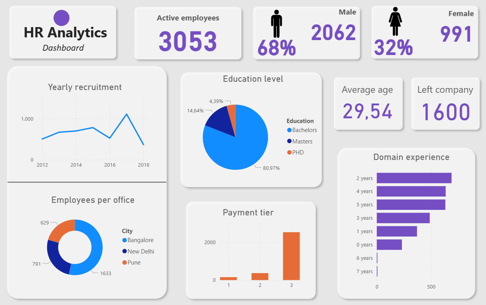

# HR Mini Case Study 👪

## Introduction
The data for this case study was taken from . It contains information about employees in a company, including their educational backgrounds, work history, demographics, and employment-related factors. The goal of this project is to generate meaningful insights using SQL and a Power BI dashboard. All insights presented in this project are original and have been independently developed by me.


## Power BI Dashboard 

***
## SQL code
### 1) How many employees does the company currently have?
``` sql
SELECT count(*) FROM employee_data
WHERE leaveornot IS false;
```
**Answer**: 3053 employees

***

### 2) What is the education of the employees?
``` sql
  SELECT education, 
	   COUNT(*) AS "Amount of employees",
       ROUND(COUNT(*) * 100.0 / (SELECT COUNT(*) FROM employee_data),2) AS "Percentage"
FROM employee_data
GROUP BY education;
```


**Answer**: Bachelor, Master, PhD
***
### 3) In what city do the employees work?
``` sql
SELECT city,
	ROUND(COUNT(*) * 100.0 / (SELECT COUNT(*) FROM employee_data),2) AS "Percentage"
	FROM employee_data
GROUP BY city;
```
**Answer**: Bangalore, Pune, New Delhi

***
### 4) Which year had the highest number of new hires?

``` sql
SELECT joiningyear as "Year joined",
		ROUND(COUNT(*) * 100.0 / (SELECT COUNT(*) FROM employee_data),2) AS "Percentage"
		FROM employee_data
GROUP BY joiningyear
ORDER BY joiningyear;
```


**Answer**: Most were hired **in 2017.**
***

### 5) Which group of employees having a certain degree has the highest chance of leaving the company?
``` sql
SELECT education,
    ROUND(
        COUNT(*) FILTER (WHERE leaveornot IS true) * 100.0 / COUNT(*),
        2
    ) AS "Leave percentage"
FROM employee_data
GROUP BY education
ORDER BY "Leave percentage" DESC;
```


**Answer**: Almost **50%** of the hired masters have left the company, this is twice as high as the hired PhDs.
***


